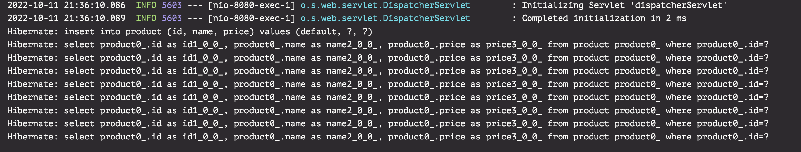
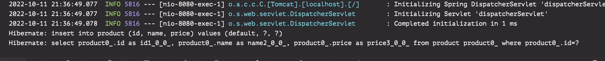

# spring-data-redis-example
#### 사용된 기술
* spring boot
* spring data jpa
* spring data redis
* gradle

#### 캐시 적용 전 GET요청
---
각각의 Get요청마다 select 쿼리 발생

#### 캐시 적용 후 GET 요청
---
한 번의 GET요청으로 얻어온 데이터를 캐시에 저장 후
Expire time 전까지 캐시에 있는 데이터를 가져옴.

여러번의 쿼리 요청에도 한 번의 쿼리 요청만 발생

